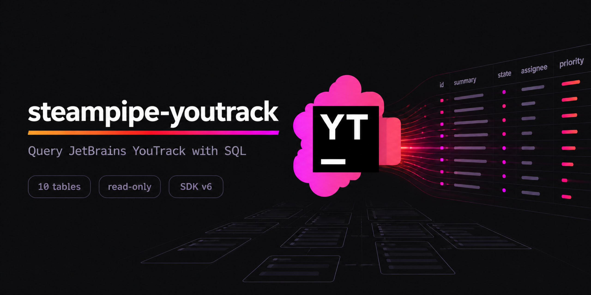

<p align="center">
  
</p>

# YouTrack Plugin for Steampipe

Use SQL to query issues, projects, users, work items, and more from JetBrains YouTrack.

- **[Get started →](https://hub.steampipe.io/plugins/rafpe/youtrack)**
- Documentation: [Table definitions & examples](https://hub.steampipe.io/plugins/rafpe/youtrack/tables)
- Community: [Steampipe Slack Channel](https://turbot.com/community/join)
- Get involved: [Issues](https://github.com/RafPe/steampipe-plugin-youtrack/issues)

> [!IMPORTANT]
> This is a community-maintained plugin. It is not an official JetBrains
> product and is not affiliated with, endorsed by, or supported by JetBrains.
> YouTrack and JetBrains are trademarks of JetBrains s.r.o.

## Quick start

Install the plugin with [Steampipe](https://steampipe.io):

```sh
steampipe plugin install rafpe/youtrack
```

Configure your connection in `~/.steampipe/config/youtrack.spc`:

```hcl
connection "youtrack" {
  plugin   = "rafpe/youtrack"
  base_url = "https://example.youtrack.cloud"
  token    = "perm:cmFmcGU=.UGVybWFuZW50IHRva2Vu.abcdefghij1234567890"
}
```

Create a permanent token in your YouTrack profile. Treat it as a password: store it in an environment variable, never commit it, and rotate it if exposed. Both arguments can instead be provided through the `YOUTRACK_URL` and `YOUTRACK_TOKEN` environment variables; values set in the connection config take precedence.

Run steampipe:

```sh
steampipe query
```

Query unresolved issues in a project:

```sql
select id_readable, summary, created
from youtrack_issue
where query = 'project: DEMO #Unresolved';
```

```
+-------------+----------------------------+---------------------------+
| id_readable | summary                    | created                   |
+-------------+----------------------------+---------------------------+
| DEMO-42     | Fix login redirect loop    | 2026-08-01T09:15:23+02:00 |
| DEMO-40     | Add SSO documentation      | 2026-07-28T14:02:11+02:00 |
+-------------+----------------------------+---------------------------+
```

Root and sub-path installations are supported; `/api` is appended exactly once. HTTPS is required except for explicit loopback E2E URLs.

## Tables

`youtrack_project`, `youtrack_issue`, `youtrack_user`, `youtrack_group`, `youtrack_tag`, `youtrack_saved_query`, `youtrack_article`, `youtrack_agile`, `youtrack_issue_comment`, and `youtrack_issue_work_item`.

Explore the [query cookbook](docs/queries.md) for reporting, JSON extraction,
aggregations, identifier lookups, and multi-table joins.

## Developing

Prerequisites:

- [Steampipe](https://steampipe.io/downloads)
- [Golang](https://golang.org/doc/install) 1.26 or newer

Clone:

```sh
git clone https://github.com/RafPe/steampipe-plugin-youtrack.git
cd steampipe-plugin-youtrack
```

Build and install the plugin into your local Steampipe plugin directory (`~/.steampipe/plugins/hub.steampipe.io/plugins/rafpe/youtrack@latest/steampipe-plugin-youtrack.plugin`):

```sh
make install
```

Configure the plugin:

```sh
cp config/youtrack.spc ~/.steampipe/config/youtrack.spc
vi ~/.steampipe/config/youtrack.spc
```

Try it:

```sh
steampipe query "select id, name from youtrack_project"
```

Further development targets: `make test`, `make test-race`, `make test-contract`, `make test-integration`, `make coverage`, `make lint`, `make build`, or the complete local CI equivalent `make check`. The integration suite crosses the SDK hydration and real HTTP transport boundaries; the coverage gate requires 100% statement coverage in first-party testable packages. See [E2E testing](docs/e2e.md) for the pinned real YouTrack and Steampipe flow.

## Releases

Releases are review-gated. Each ordinary pull request has exactly one label
(`release/major`, `release/minor`, `release/patch`, or `release/skip`) and each
non-skip change has a Changie fragment. Ordinary merges never publish. A
maintainer runs **Prepare Release**, reviews the generated `release/next` pull
request, and merging it triggers verification, E2E, immutable tagging,
artifact builds, and publication with the curated changelog as release notes. See
[docs/releases.md](docs/releases.md) for the full contributor and maintainer
guide, including recovery procedures and artifact verification.

## Compatibility

The matrix distinguishes versions exercised by this repository from versions
that are expected to work through the Steampipe plugin protocol.

| Component | Version | Status | Notes |
| --- | --- | --- | --- |
| Steampipe CLI | 2.3.2 | Verified | Manually verified and pinned by the real-process E2E harness. |
| Steampipe Plugin SDK | 6.0.0 | Verified | Direct build dependency. |
| YouTrack Cloud | Current REST API | Supported | Uses permanent-token authentication and `/api` resources. |
| YouTrack Server | 2026.1 or later | Supported | Required for current `/api/users` and `/api/groups` resources. |
| Go | 1.26.x | Verified | Required to build and test from source. |
| Turbot Pipes | Current | Expected | Plugin metadata supports Pipes; not covered by the local E2E suite. |

Other Steampipe CLI releases compatible with Plugin SDK v6 may work but are not
part of the verified test matrix. See [E2E testing](docs/e2e.md) for the pinned
runtime versions and known bootstrap constraint.

## Limitations

Results reflect the token user's permissions. YouTrack Server 2026.1 or later is required for the current `/api/users` and `/api/groups` resources; the plugin never falls back to deprecated Hub endpoints. The pinned YouTrack E2E container requires a one-time supported first-run wizard and manual permanent-token creation. Steampipe 2.3.2 runs from its official checksum-verified release archive because Turbot no longer publishes an official current container image.

## Contributing

Add one red-green-refactor slice at a time, document schema changes, keep credentials out of fixtures and logs, and run `make check` before opening a pull request. Contributions are licensed under Apache-2.0.

Security issues must be reported privately as described in the
[security policy](SECURITY.md). Release changes are recorded in the
[changelog](CHANGELOG.md).
